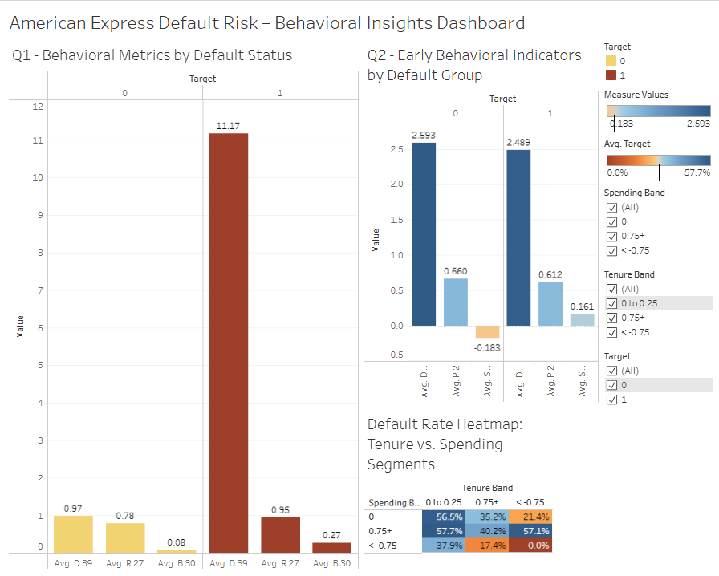

# 💳 American Express Default Risk Dashboard

### Identifying behavioral trends, early risk signals, and customer segmentation insights using SQL and Tableau.

This project analyzes customer behavior and financial attributes to understand default risk trends in American Express data. Insights were developed using SQL, cleaned via Python, and visualized with a stakeholder-ready Tableau dashboard.

---

## 🧾 Executive Summary

This dashboard addresses three strategic risk and customer profiling questions:

1. **Which behavioral patterns or customer segments are most associated with default risk?**
2. **Are there any early behavioral indicators that consistently predict default before it occurs?**
3. **How does the overall credit health of our portfolio vary by customer tenure and spending?**

### 📊 Dashboard Overview

- Visual insights include:
  - Default likelihood by key behavioral features (`D_39`, `B_30`, `P_2`)
  - Risk trends across customer tenure and average transaction value
  - Indicators that change over time prior to default events

> 🔗 [View the live dashboard on Tableau Public](YOUR_TABLEAU_PUBLIC_LINK_HERE)



---

### ✅ Actionable Recommendations

- **Monitor behavioral indicators like `D_39`, `P_2`, and `B_30` for early signs of risk.**
  - *🛡 Risk Team Insight:* These can serve as triggers for internal alerts or preemptive outreach.

- **Target customers with short tenure and low average spend for account review.**
  - *💰 Finance Insight:* Supports refining credit exposure and limit management policies.

- **Build retention campaigns for low-risk, mid-tenure customers who show positive engagement metrics.**
  - *📣 Marketing Insight:* Improve LTV by nurturing customer groups that show long-term potential.

- **Use pattern deviation as input into predictive models.**
  - *🧠 Data Science Insight:* Indicators like volatility in `B_30` can enhance churn or risk prediction models.

---

## 🔍 Deep Dive: Analytical Approach

### 🧮 Dataset Overview
- 100,000-record sample from American Express default prediction dataset
- ~190 anonymized behavioral and financial variables
- Data collected across time steps for each customer ID
- Null-heavy fields dropped (>85%) to ensure visual clarity

### 💾 SQL-Based Analysis
- Wrote custom `CREATE TABLE` schema to structure anonymized variables
- Used MySQL to:
  - Segment customers by tenure, spending, and risk metrics
  - Identify high-risk groups based on key features
  - Correlate behavioral indicators with default outcome

### 📊 Tableau Visualizations
- **Bar charts:** Segment-level default trends
- **Box plots:** Risk scores by tenure and utilization
- **Line plots:** Pre-default indicator drop-off visualization

---

## 🔗 Data Source

This dataset comes from the [Kaggle - Amex Default Prediction (Parquet Format)](https://www.kaggle.com/datasets/raddar/amex-data-integer-dtypes-parquet-format).

> Kaggle Note: Float columns between 0.00–0.01 and 1.00–1.01 were rounded to 0 and 1 respectively for anonymization. This has been considered in the analysis.

### 📁 Cleaned Dataset (Sample of 100,000 Rows)
Due to GitHub's file size limits, the full cleaned dataset has been uploaded to Google Drive.

🔗 [Download via Google Drive](./data/cleaned_dataset_link.md) 

---

## 🛠️ Tools Used

- **SQL (MySQL dialect):** Schema setup and data exploration
- **Tableau Public:** Executive dashboard creation
- **Python (Pandas):** Null handling, sampling, and CSV conversion
- **Google Colab + Drive:** Dataset preparation and large file handling

---

## 📁 Repository Structure

```
amex-default-risk/
│
├── data/
│   └── cleaned_dataset_link.md         # External link to cleaned 100k-row CSV
│
├── sql/
│   ├── amex_create_table.sql           # Table schema setup
│   ├── amex_query_1.sql                # Segment default risk analysis
│   ├── amex_query_2.sql                # Early indicator analysis
│   └── amex_query_3.sql                # Portfolio credit health analysis
│
├── images/
│   └── dashboard_preview.png           # Tableau dashboard preview
│
├── README.md                           # Project documentation
└── LICENSE                             # Repository license
```

---

## 👋 About the Analyst

**Jeremy Gutierrez**  
Data Analyst with a strong foundation in SQL and data storytelling. Background in healthcare and operations with experience communicating insights to cross-functional stakeholders.  
[Connect on LinkedIn](https://www.linkedin.com/in/jeremy-gutierrez-4502391bb/) • [View GitHub Portfolio](https://github.com/JZambrana1612) 
